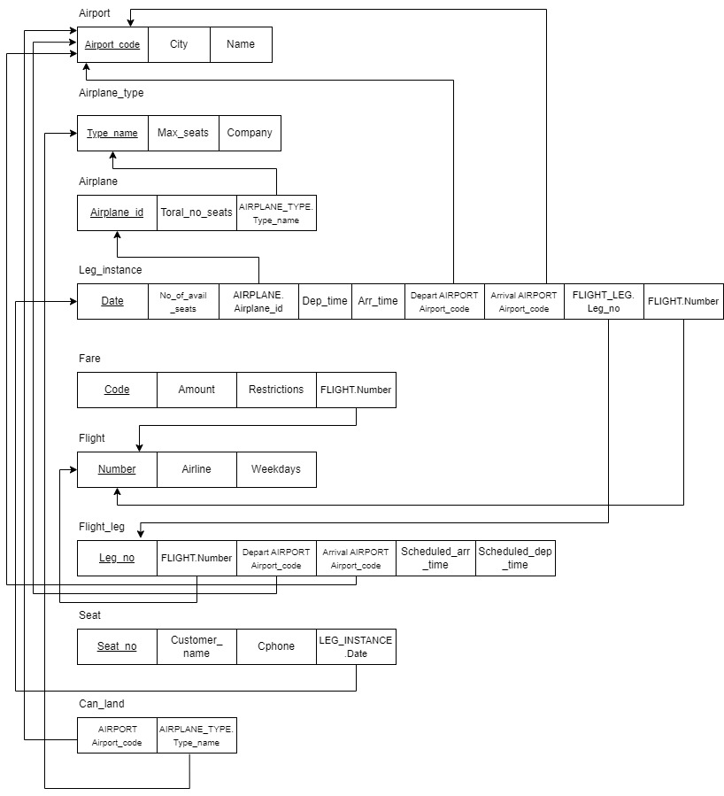

# BD: Guião 3


## ​Problema 3.1
 
### *a)*

```
CLIENTE(NIF, nome, endereço, num_carta )

ALUGUER(número, duracao, data)

BALCAO(número, nome, endereco)

VEICULO(matricula, ano, marca)

TIPO_VEICULO(codigo, designacao, arcondicionado)

LIGEIRO(numlugares, portas, combustivel)

PESADO(peso, passageiros)

SIMILARIDADE_TIPO_VEICULO(tipo_codigo A, tipo_codigo B)

```


### *b)* 

```
|                           | Chave Candidata               | Chave Primária              | Chave Estrangeira                      |
|---------------------------|-----------------              |----------------             |----------------------------------------|
| CLIENTE                   |  num_carta, NIF               | NIF                         | -------------------------------------- |
| ALUGUER                   |  número                       | número                      | NIF_cliente,n_balcao,matricula_veiculo |
| BALCAO                    |  número                       | número                      | -------------------------------------- |
| VEICULO                   |  matricula                    | matricula                   | tipo_codigo                            |
| TIPO_VEICULO              |  codigo                       | codigo                      | -------------------------------------- |
| LIGEIRO                   | ----------------------------- | --------------------------- | tipo_codigo                            |
| PESADO                    | ----------------------------- | --------------------------- | tipo_codigo                            |
| SIMILARIDADE_TIPO_VEICULO | tipo_codigo A, tipo_codigo B  |tipo_codigo A, tipo_codigo B | tipo_codigo A, tipo_codigo B           |

```


### *c)* 


## ​Problema 3.2

### *a)*

```
... Write here your answer ...
```


### *b)* 

```
... Write here your answer ...
```


### *c)* 




## ​Problema 3.3


### *a)* 2.1


### *b)* 2.2


### *c)* 2.3


### *d)* 2.4

