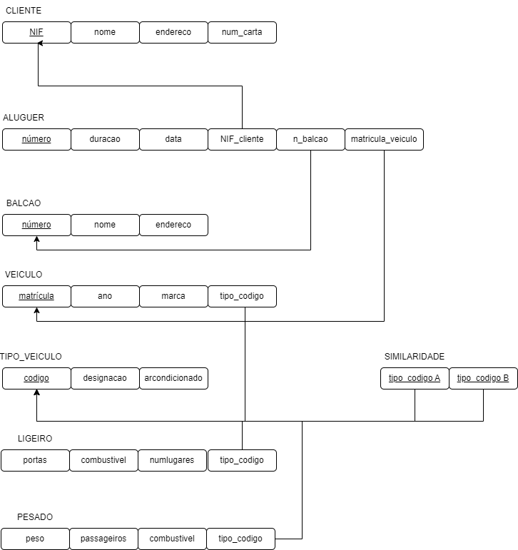
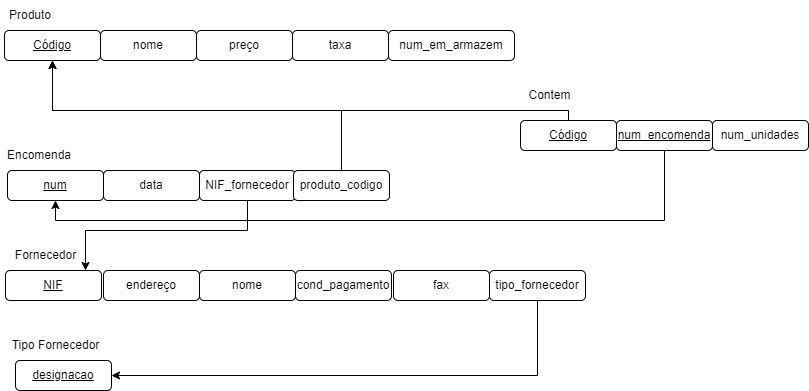
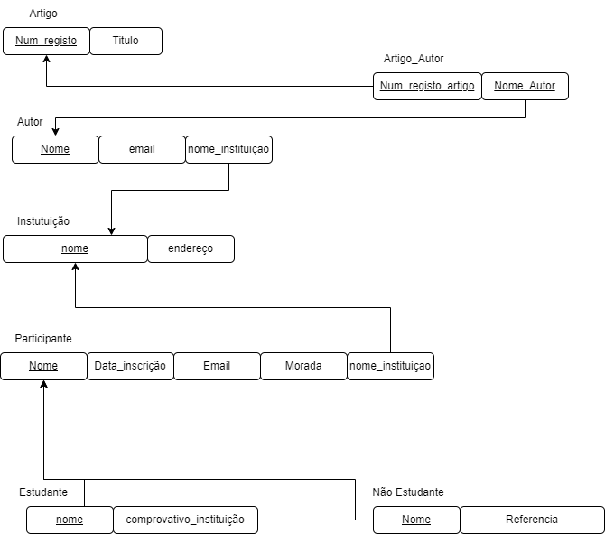

# BD: Guião 3

## ​Problema 3.1

### _a)_

```
CLIENTE(NIF, nome, endereço, num_carta )

ALUGUER(número, duracao, data)

BALCAO(número, nome, endereco)

VEICULO(matricula, ano, marca)

TIPO_VEICULO(codigo, designacao, arcondicionado)

LIGEIRO(numlugares, portas, combustivel)

PESADO(peso, passageiros)

SIMILARIDADE_TIPO_VEICULO(tipo_codigo A, tipo_codigo B)

```

### _b)_

```
|                           | Chave Candidata               | Chave Primária              | Chave Estrangeira                      |
|---------------------------|------------------------------ |---------------------------- |----------------------------------------|
| CLIENTE                   |  num_carta, NIF               | NIF                         | -------------------------------------- |
| ALUGUER                   |  número                       | número                      | NIF_cliente,n_balcao,matricula_veiculo |
| BALCAO                    |  número                       | número                      | -------------------------------------- |
| VEICULO                   |  matricula                    | matricula                   | tipo_codigo                            |
| TIPO_VEICULO              |  codigo                       | codigo                      | -------------------------------------- |
| LIGEIRO                   | ----------------------------- | --------------------------- | tipo_codigo                            |
| PESADO                    | ----------------------------- | --------------------------- | tipo_codigo                            |
| SIMILARIDADE_TIPO_VEICULO | tipo_codigo A, tipo_codigo B  |tipo_codigo A, tipo_codigo B | tipo_codigo A, tipo_codigo B           |

```

### _c)_



## ​Problema 3.2

### _a)_

```
Esquema relação r(R):

AIRPORT(Airport_code, City, State, Name)
AIRPLANE_TYPE(Type_name, Max_seats, Company)
AIRPLANE(Airplane_id, Total_no_of_seats, AIRPLANE_TYPE.Type_name)
LEG_INSTANCE (Date, No_of_avail_seats, AIRPLANE.Airplane_ID, Dep_time, Arr_time, Departe AIRPORT.Code, Arrival AIRPORT.Code, FLIGHT.Number, FLIGHT_LEG.no)
FARE(Code, Amount, Restrictions, FLIGHT.Number)
FLIGHT(Number, Airline, Weekdays)
FLIGHT_LEG(Leg_no, FLIGHT.Number, Departe AIRPORT.Code, Arrival AIRPORT.Code, Scheduled_arr_time, Scheduled_dep_time,
SEAT(Seat_no, Customer_name, Cphone, LEG_INSTANCE.Date)
CAN_LAND (AIRPORT.Airport_code, AIRPLANE.Type_name)

```

### _b)_

```
---Chaves candidatas---
AIRPORT - Airport_code, Name
AIRPLANE_TYPE - Type_name
AIRPLANE - Airplane_id
LEG_INSTANCE - Date
FARE - Code
FLIGHT - Number
FLIGHT_LEG - Leg_no
SEAT - Seat_no
CAN_LAND -AIRPORT.Airport_code, AIRPLANE.Type_name

---Chaves primárias---
AIRPORT - Airport_code
AIRPLANE_TYPE - Type_name
AIRPLANE - Airplane_id
LEG_INSTANCE - Date
FARE - Code
FLIGHT - Number
FLIGHT_LEG - Leg_no
SEAT - Seat_no

---Chaves estrangeiras---
AIRPLANE - AIRPLANE_TYPE.Type_name
LEG_INSTANCE - AIRPLANE.Airplane_ID, Departe AIRPORT.Code, Arrival AIRPORT.Code, FLIGHT.Number, FLIGHT_LEG.no
FARE - FLIGHT.Number
FLIGHT_LEG - FLIGHT.Number, Departe AIRPORT.Code, Arrival AIRPORT.Code, 
SEAT - LEG_INSTANCE.Date
CAN_LAND - AIRPORT.Airport_code, AIRPLANE.Type_name


```

### _c)_


## ​Problema 3.3

### _a)_ 2.1




### _b)_ 2.2


### _c)_ 2.3



### _d)_ 2.4


